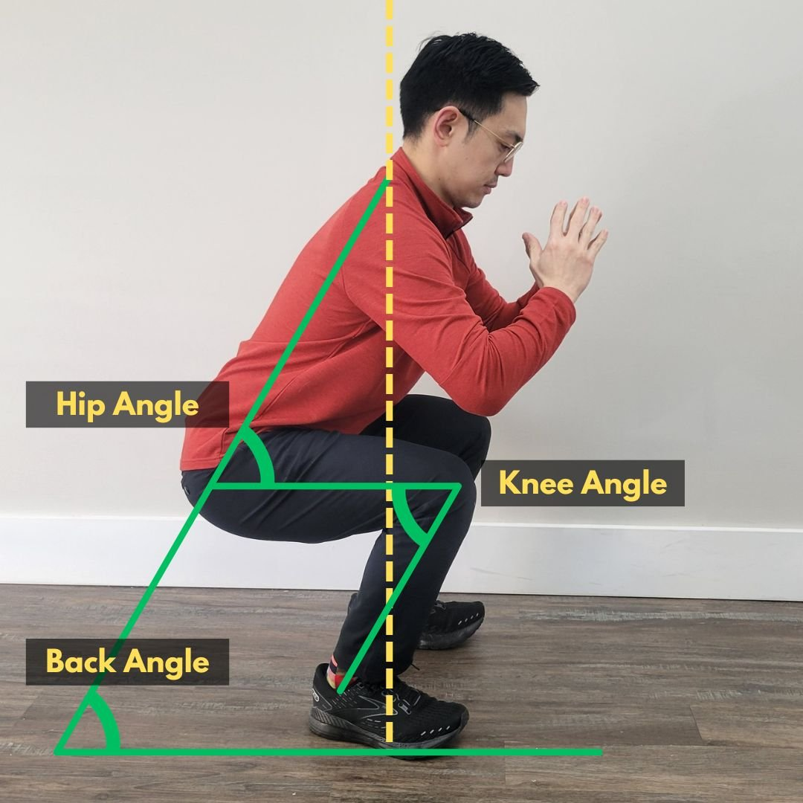
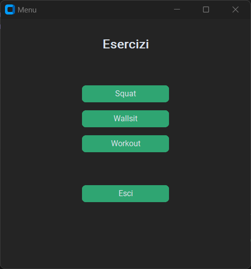
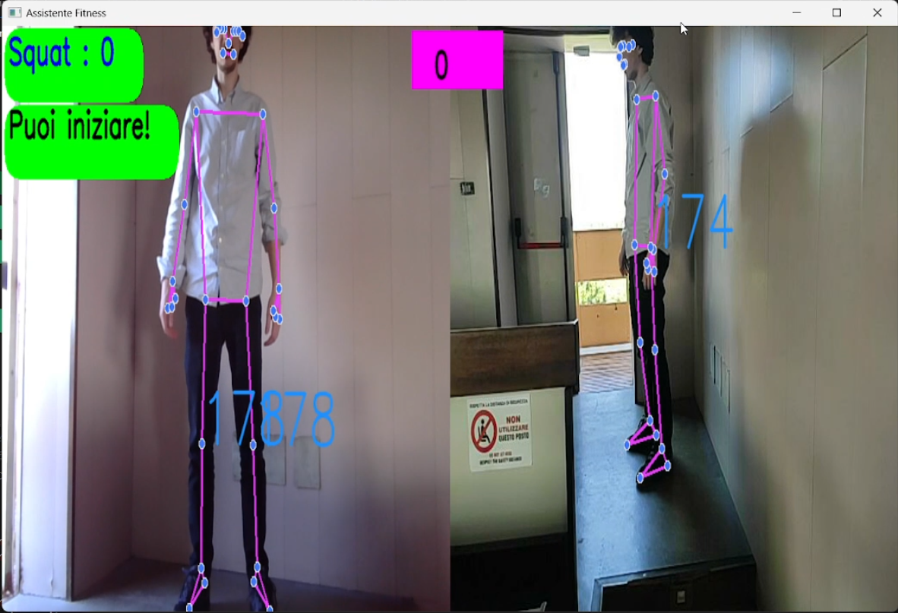

# Multimodal-interaction
Multimodal-interaction exam project

This project aimed to develop a virtual personal trainer that thanks to two cameras can track different kinds of exercise and support the user through guided workouts and audio and video hints and corrections.

In this project, we focused on multimodality, and so there are different technologies we imported from Google as *MediaPipe* for pose estimation and *Google Speech Recognition*.

In particular, we use 2 different cameras to capture video from different angles to better estimate the position of the user in each frame in real-time, to achieve a high precision in angles calculus. To estimate the *landmarks* and obtain information about the angles we use two different *MediaPipe* pose estimation models, one for each camera, the frontal one is responsible for checking that there is the right distance between legs and that the backbone is aligned. the side camera ensures that the body is exposed in the front or on the back and calculates the angle of the hip and knee.

Image from:
www.breakfreephysiotherapy.ca/blog/low-back-pain-from-squats

Executing the main.py script, you will launch the app and display the menu.
Here you can select one particular exercise or start a workout:

Once you select one exercise you will be asked, thanks to the voice synthesiser, to give some details about the exercise, such as how many repetitions, sets and the recovery time all through speech interaction.
This feature has to be improved and it depends a lot on your bandwidth (Google Speech Recognition just records the audio and sends it to a server to analyze it).
Then the exercise will start and you should see landmarks appear on your body.

**Squat**: when the exercise starts the user can see landmarks and angles on your body. In the top right corner, there is the counter, only good executions will be considered by it, in the top centre there is the timer, \
which starts at the exact moment the user starts the first squat, 
and the feedback the app gives to the user during the exercise: good repetition, too fast, too slow, should go a bit more down or your backbone is not aligned.

**Wallsit**:

**Workout**:
